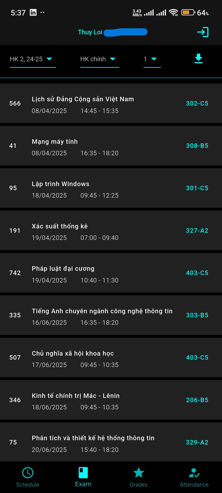

# TLU_Student-Academic-Info
Here I provide a class specifically designed for fetching and cleaning data from my school's super messy API. This class handles responses from API requests to fetch schedule, exam schedule, and grades.

## Preview

    

        
        
        
    

  

    

        
This is not my grade

        
Attendance tracking for selected subjects after fetching the class schedule; they remain even if you fetch a new class schedule.

    

    
    
        
        
    

  

## Overview
As a student attending Thuy Loi University, you're probably familiar with our school website. It's notoriously slow, primarily because it sends hundreds of requests every time you perform an action. The last time I checked, it generated 134 requests and consumed 70MB of data. Most of the JSON that the server sends back is overwhelming, often containing up to 20,000 lines or even over 1,000,000 lines. In many fields and subfields, you'll find a plethora of null values, duplicated fields, or sometimes both.

In my Flutter app, it sends only the necessary requests. While it still receives the messy JSON, I’ve cleaned it up so that only the relevant fields are displayed.

In this repository, I’m sharing the data-cleaning code with the hope that it will be useful to others who are working on their own applications or tools that utilize our school's API, so you don't have to waste some of your time cleaning the data yourself.
